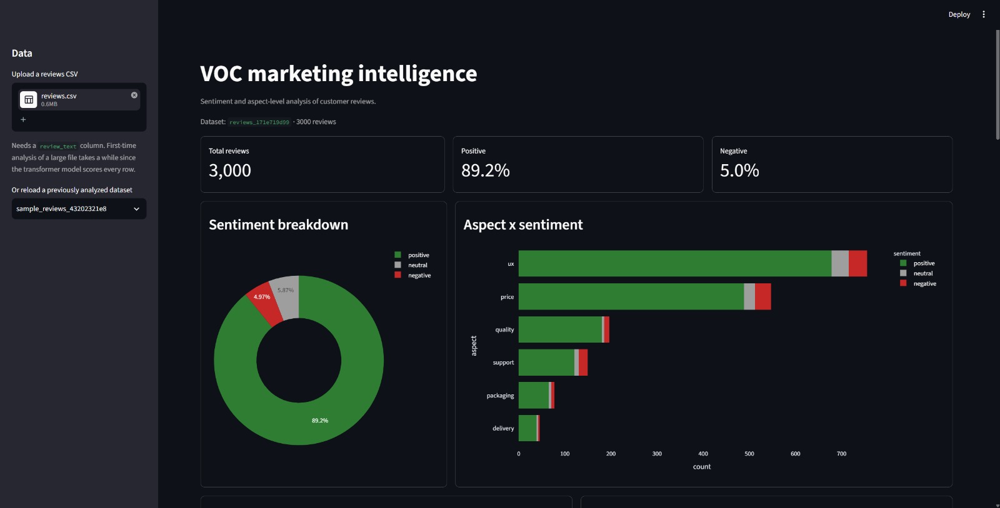

# VoC Marketing Intelligence

**An end-to-end Voice-of-Customer analytics system that turns raw customer reviews into sentiment, aspect-level insight, and AI-generated marketing strategy.**

Upload a CSV of customer reviews and get back a full marketing-intelligence readout: how customers feel, *what* they're talking about, the themes no one pre-defined, and a prioritized set of marketing recommendations written by an LLM and grounded strictly in the computed data.



---

## Why it exists

Businesses sit on tens of thousands of reviews and read almost none of them. Star ratings hide *why* customers feel the way they do, and even when a team finds a signal, turning it into action is a separate manual job. This system closes that loop — from raw reviews to a strategy a marketer can act on.

## What it does

- **Sentiment** — positive / neutral / negative on every review via a transformer model (`cardiffnlp/twitter-roberta-base-sentiment-latest`), benchmarked against a VADER lexicon baseline.
- **Aspect mining** — tags what customers discuss (delivery, price, quality, support, packaging, UX) and crosses it with sentiment to surface top complaints and top praise.
- **Topic discovery** — BERTopic surfaces themes no one hard-coded, exposing what a fixed lexicon misses.
- **Interactive dashboard** — Streamlit app with sentiment breakdowns, aspect×sentiment charts, word clouds, a sentiment-over-time view, and a filterable review table.
- **AI strategy layer** — an LLM (Google Gemini) reads the computed aggregates and writes an executive summary plus prioritized, **grounded** recommendations — every claim tied to a real number, no fabrication.

## Key results

Validated on the [Datafiniti Amazon Consumer Reviews](https://www.kaggle.com/datasets/datafiniti/consumer-reviews-of-amazon-products) dataset (34,659 cleaned reviews; 3,000-row analysis sample).

| Metric | VADER (lexicon) | Transformer (RoBERTa) |
|---|---|---|
| Macro-F1 | 0.42 | **0.51** |
| Negative-class recall | 0.36 | **0.74** |

The dataset is ~94% positive, so headline accuracy is inflated for both models — the honest metrics are **macro-F1** and **negative-class recall**, where the transformer catches roughly **twice as many dissatisfied customers**.

**Headline finding:** the six hand-built aspects were tuned for delivery/service language; on real electronics reviews, BERTopic discovered **31 themes** (battery life, screen/glare, apps, setup, streaming, Alexa…) the lexicon never captured — direct evidence that keyword lexicons don't transfer across domains, and that unsupervised topic modeling is what reveals the gap.

## Architecture

```
Ingest -> Clean -> Sentiment -> Aspects -> Persist -> Strategize
 CSV      dual-    VADER +      keyword    SQLite     Gemini
 load     track    RoBERTa      + BERTopic  cache     (grounded)
```

The cleaning stage is **dual-track**: a *light* clean (URLs/HTML only, case and punctuation preserved) feeds the sentiment models, and a *deep* clean (lowercased, lemmatized, stop-words removed) feeds topic modeling and word clouds — because aggressive cleaning that helps topic mining actively hurts sentiment.

```
voc-marketing-intelligence/
├── config.py                 # central paths + column mappings
├── src/
│   ├── data/                 # CSV load + validation
│   ├── preprocessing/        # dual-track text cleaning
│   ├── sentiment/            # VADER, transformer, evaluation
│   ├── aspects/              # keyword tagger + BERTopic
│   ├── db/                   # SQLite persistence + strategy cache
│   ├── strategy/             # Gemini grounded recommendations
│   └── pipeline.py           # composed analyze() for the dashboard
├── dashboard/app.py          # Streamlit app
├── tests/                    # 31-test pytest suite
└── reports/                  # generated results artifacts
```

## Tech stack

Python · spaCy · Hugging Face Transformers · scikit-learn · VADER · BERTopic · Streamlit · Plotly · SQLite · Google Gemini API · pytest

## Getting started

```bash
# 1. clone + create a virtual environment
git clone https://github.com/Dhwanitisshah/voc-marketing-intelligence.git
cd voc-marketing-intelligence
python -m venv .venv
.venv\Scripts\activate          # Windows  (source .venv/bin/activate on macOS/Linux)

# 2. install
pip install -r requirements.txt
python -m spacy download en_core_web_sm

# 3. (optional) add a Gemini key for the strategy layer
echo GEMINI_API_KEY=your_key_here > .env

# 4. run the dashboard
streamlit run dashboard/app.py --server.fileWatcherType none
```

Upload the bundled `data/sample/sample_reviews.csv` to see it work immediately, or drop your own CSV at `data/raw/reviews.csv` and point the column names in `config.py` at it.

### Batch pipeline (CLI)

```bash
python src/preprocessing/clean_text.py    # -> reviews_clean.parquet
python src/sentiment/run_sentiment.py     # -> reviews_sentiment.parquet
python src/sentiment/evaluate.py          # VADER vs transformer comparison
python src/aspects/run_aspects.py         # keyword tags + BERTopic + aspect summary
```

## Testing

```bash
pytest -m "not slow" -v     # fast suite (~10s)
pytest -v                   # full suite (31 tests)
```

The suite runs against an isolated temporary database and a mocked LLM — no live API calls, no pollution of your real data.

## Future scope

- **Aspect-based sentiment** — score sentiment *per aspect* rather than inheriting the whole review's sentiment.
- **Adaptive lexicon** — auto-expand aspects from BERTopic's discovered topics to close the domain-coverage gap.
- **Column auto-mapping** — detect the review/rating/date columns on upload so any CSV works without editing config.
- **Multilingual support** — extend to non-English reviews for Indian and global markets.
- **Live ingestion** — scrape/stream reviews for continuous monitoring instead of one-off uploads.
- **Deploy & scale** — GPU batch scoring and hosted deployment for full-dataset (30k+) runs and multi-user access.

## License

MIT
